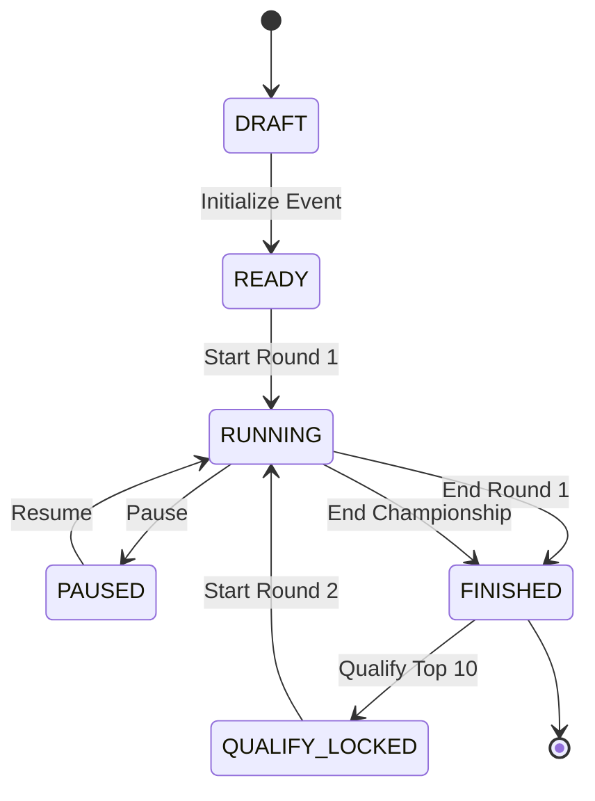

# SASI Engineers' Day — Live Competition Platform

A high-performance, real-time competition platform built for **SASI Institute of Technology & Engineering** to host live collegiate coding and technical quiz events:
1. **C Debugging Arena** — Real-time GCC compilation and testcase execution in isolated sandboxes with Monaco Editor.
2. **Technical Quiz Arena** — 2-round multi-stage competition engine with 8 interactive challenge formats, live Socket.IO leaderboards, and administrative qualification controls.

---

## 🚀 Key Highlights

- **SASI Brand Design System**: Clean, minimal Red (`#E4002B`) & White control-room visual identity with zero clutter, card elevations, badge tints, and accessibility contrast.
- **Two-Round Tournament Architecture**:
  - **Round 1 (Qualifiers)**: Up to 60 students compete across 4 stages (Rapid Fire, Guess the Tech, Tech Shuffle, Puzzle Grid).
  - **Promotion Lock-In**: Admin reviews and confirms the top 10 finalists via a modal with instant tie-breaking verification.
  - **Round 2 (Championship)**: Top 10 finalists compete across 4 advanced stages (Tech Showdown, Tech Today, Real or Fake, Final Challenge) while eliminated students receive a respectful completion screen.
- **8 Distinct Challenge Mechanics**:
  - ⚡ `RAPID_FIRE`: Timed MCQs testing fast recall.
  - 🔍 `GUESS_THE_TECH`: Image-based identification with drag-and-drop admin uploads and static image serving.
  - 🔀 `TECH_SHUFFLE`: Interactive sequence arranging with smooth reordering controls.
  - 🧩 `PUZZLE_GRID`: 8-puzzle sliding grid algorithm challenge.
  - ⚔️ `TECH_SHOWDOWN`: High-stakes speed & accuracy championship questions.
  - 📰 `TECH_TODAY`: Contemporary tech industry trends & trivia.
  - ⚖️ `REAL_OR_FAKE`: Fast binary real/fake technology claim identification.
  - 🏆 `FINAL_CHALLENGE`: Deciding championship problem.
- **Admin Control Room**:
  - Single-action reactive state controller (`Start Round 1`, `Pause`, `Resume`, `Qualify Top 10`, `Start Round 2`, `End`).
  - Scoped Quiz Management by Round (Round 1 vs Round 2 filter).
  - Drag-and-drop image upload dropzone with live thumbnail previews.
  - Excel/CSV Question Bank bulk import (`.xlsx`, `.csv`).
  - Real-time Socket.IO leaderboard synchronization without full page reloads.

---

## 🛠️ Technology Stack

| Layer | Technology |
|---|---|
| **Frontend** | React 18, TypeScript, Vite, CSS Modules, Monaco Editor, Lucide Icons |
| **Backend** | Node.js, Express, TypeScript, Socket.IO, Multer |
| **Database & ORM** | SQLite / PostgreSQL, Prisma ORM |
| **Execution Engine** | GCC (GNU C Compiler) sandbox with runtime isolation and memory/time limit controls |
| **Authentication** | JWT (JSON Web Tokens) with HTTP Bearer authorization |

---

## 📋 Prerequisites

- **Node.js**: v18.0.0 or higher (v20+ / v24 recommended)
- **npm**: v9.0.0 or higher
- **GCC**: GNU Compiler Collection (required for compiling student C debugging submissions)

Verify installed versions:
```bash
node -v
npm -v
gcc --version
```

---

## ⚡ Quickstart Setup

### 1. Clone the repository
```bash
git clone https://github.com/phani-kumar-01/event.git
cd event
```

### 2. Configure Environment Variables
Create `.env` in the root and `server/` directories:
```bash
cp .env.example server/.env
```

Ensure `server/.env` contains:
```env
PORT=3001
JWT_SECRET="sasi-engineers-day-super-secret-key-2026"
DATABASE_URL="file:../prisma/sasi-engineers-day.db"
CLIENT_ORIGIN="http://localhost:5173"
ADMIN_ORIGIN="http://localhost:5174"
```

### 3. Install Dependencies
```bash
# Install server dependencies
cd server
npm install

# Install client dependencies
cd ../client
npm install
```

### 4. Initialize Database & Seed Sample Data
```bash
cd ../server
# Push Prisma schema to SQLite
npm run db:push

# Seed default admin, student accounts, sample events, problems & questions
npm run db:seed
```

### 5. Run Development Servers
Open two terminal windows:

**Terminal 1 (Backend API & Socket.IO):**
```bash
cd server
npm run dev
```
*Server runs on [http://localhost:3001](http://localhost:3001)*

**Terminal 2 (Student & Admin Client):**
```bash
cd client
npm run dev
```
*Student portal runs on [http://localhost:5173](http://localhost:5173)*  
*Admin portal runs on [http://localhost:5174](http://localhost:5174)* (or navigate to `/admin` route on 5173)

---

## 👥 Default Credentials

| Portal | URL | Roll No / Username | Password | Role |
|---|---|---|---|---|
| **Admin Portal** | `http://localhost:5174` | `ADMIN001` | `admin123` | Administrator |
| **Student Portal** | `http://localhost:5173` | `CS001` to `CS060` | `student123` | Student Participant |

---

## 🏆 Competition Architecture

### Event State Machine


### Category Taxonomy
All quiz questions are strictly partitioned into 6 standardized categories:
- `AI` (Artificial Intelligence & Machine Learning)
- `GADGETS` (Hardware, Microprocessors, Consumer Tech)
- `CYBERSECURITY` (Networks, Cryptography, Security)
- `SPACE` (Aerospace Engineering, Satellite Tech, Astronomy)
- `GAMING` (Game Engines, Graphics, Interactive Media)
- `FOUNDERS` (Pioneers, Computing History, Tech Giants)

---

## 📡 REST API Reference

### Authentication (`/api/auth`)
- `POST /api/auth/login` — Authenticate user via `rollNo` and `password`. Returns JWT token and user profile.

### Student Endpoints (`/api`)
- `GET /api/current-event` — Fetch active event state, round timers, and qualification lock status.
- `GET /api/events/:id/quiz-challenges` — Get available challenge stages for student's current round.
- `GET /api/events/:id/quiz-questions` — Fetch question payload for active round (answers omitted).
- `POST /api/events/:id/quiz-answers` — Submit student response for a quiz question.
- `POST /api/events/:id/puzzle-submit` — Submit sliding puzzle state and move count.
- `GET /api/events/:id/debugging-problems` — Fetch C debugging problems and test cases.
- `POST /api/events/:id/run-code` — Compile and execute C code preview against sample test cases.
- `POST /api/events/:id/submit-code` — Submit final C code for official scoring.

### Admin Endpoints (`/api/admin`)
- `GET /api/admin/events` — List all events and configurations.
- `POST /api/admin/events/:id/start-round1` — Begin Round 1 for qualifiers.
- `POST /api/admin/events/:id/pause` — Pause current running round.
- `POST /api/admin/events/:id/resume` — Resume paused round.
- `POST /api/admin/events/:id/end-round1` — Conclude Round 1 and calculate rankings.
- `POST /api/admin/events/:id/qualify-round1` — Confirm and promote top 10 finalists to Round 2.
- `POST /api/admin/events/:id/start-round2` — Begin Round 2 Championship.
- `POST /api/admin/events/:id/end-round2` — Finalize Championship and calculate final winners.
- `GET /api/admin/events/:id/round1-leaderboard` — Get Round 1 qualification leaderboard.
- `GET /api/admin/events/:id/final-leaderboard` — Get Final Championship rankings.
- `POST /api/admin/quiz-questions` — Create new question (with category and image validation).
- `PATCH /api/admin/quiz-questions/:id` — Update existing question.
- `DELETE /api/admin/quiz-questions/:id` — Delete question.
- `POST /api/admin/quiz-questions/upload-image` — Upload question image (`multipart/form-data`, max 5MB, JPG/PNG/WEBP).
- `POST /api/admin/quiz-questions/import` — Bulk import questions via Excel/CSV spreadsheet.
- `GET /api/admin/students` — List all registered student accounts.
- `POST /api/admin/students` — Register a new student account.

---

## ⚡ Socket.IO Real-Time Protocol

| Event Channel | Direction | Payload Description |
|---|---|---|
| `join:event` | Client → Server | `{ eventId: string }` joins room for real-time updates. |
| `leave:event` | Client → Server | `{ eventId: string }` leaves event room. |
| `event.state_changed` | Server → Client | Emitted when event status or round transitions occur. |
| `leaderboard.update` | Server → Client | Emitted on new score submissions to refresh standings. |
| `admin:results_updated` | Server → Client | Emitted when background scoring completes. |
| `user:status_changed` | Server → Client | Emitted when student connects or disconnects. |

---

## 📁 Project Structure

```
event/
├── client/                     # React + Vite Frontend Application
│   ├── public/                 # Static assets & icons
│   ├── src/
│   │   ├── components/         # Reusable UI widgets (ConnectionBadge, SlidingPuzzle, TechShuffle, etc.)
│   │   ├── hooks/              # Custom hooks (useTimer, useConnectionStatus, useQuizEngine)
│   │   ├── pages/              # Primary views (AdminPage, QuizPage, DebuggingPage, WaitingPage, LoginPage)
│   │   ├── services/           # Axios API instance and Socket.IO client
│   │   ├── state/              # AuthContext & state providers
│   │   └── styles/             # Global CSS variables & design tokens
│   ├── vite.config.ts          # Main client Vite configuration
│   └── vite.admin.config.ts    # Dedicated admin Vite configuration
├── server/                     # Node.js + Express Backend
│   ├── src/
│   │   ├── routes/             # REST Route handlers (admin.ts, student.ts, auth.ts)
│   │   ├── socket/             # Socket.IO connection and broadcast managers
│   │   ├── utils/              # C compilation sandbox, Excel parser, JWT helpers
│   │   └── index.ts            # Server entrypoint and static upload serving
│   └── uploads/questions/      # Static image uploads directory
├── prisma/                     # Database layer
│   ├── schema.prisma           # Prisma data models & relations
│   └── seed.ts                 # Database seeding script with realistic competition data
├── docs/                       # Detailed architecture & API documentation
└── package.json                # Monorepo root configuration
```

---

## 📦 Production Build

```bash
# 1. Build backend TypeScript
cd server
npm run build

# 2. Build student frontend & admin bundle
cd ../client
npm run build
npm run build:admin
```

Production artifacts will be generated in `server/dist/`, `client/dist/`, and `client/dist-admin/`.

---

## 🛡️ License

Developed for SASI Institute of Technology & Engineering — Engineers' Day Competition.
All rights reserved.
